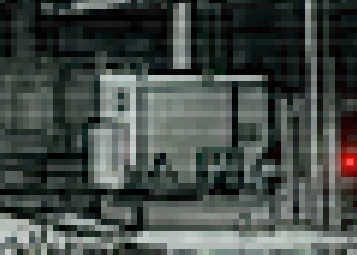

## Spaceframe Solution
Эта игра разработана 4 студентами во время форума "Время IT" в ГУАП в рамках хакатона (геймджема) за одни сутки.

Краткое видео-демо без звука есть на [YouTube](https://youtu.be/mbGU5pnDskk)

## В чем идея?
Spaceframe Solution – игра о далеком будущем, где человечество более не сковано звездным небом.

Сюжет разворачивается в 2444 году, на борту заброшенного ныне корабля торговой космической палаты Персифаль.
Главный герой, единственный оставшийся в живых на полуразрушенной станции, оказывается в противоречивой ситуации.

Познакомившись с местным операционным андроидом, Сэнтиэль, главный герой узнает о том, что его единственный шанс спастись – разблокировать принудительно запечатанные двери.
Но все не может быть так просто...

## Механики и общее устройство
Игрушка представляет собой 2D point-n-click квест в стиле пиксель арт с 4 доступными экранами

Есть система отрисовки текста для продвижения сюжета (видно на 1 скрине)

Первый экран 

Второй экран 

Третий экран 

Четвертый экран 

### Выделение объектов на фоне
При наведении мыши на предметы, с которыми можно взаимодействовать, у них появляется обводка 

### Взаимодействие и инвентарь
При взаимодействии с объектами на фоне открывается доп. экран.
Предметы можно брать в инвентарь и там повертеть их 3D модельку

Отвертка лежит в ящике 

Осмотр отвертки в инвентаре 

На некоторых предметах есть подсказки к решению загадок 

### Загадки

Расставить предохранители в нужном порядке. На каждом предохранителе есть подсказка 

Перевести все желтые молнии наверх, а зеленые - вниз.
Молнии могут перемещаться на 1 клетку (желтые вверх, зеленые вниз) или перескакивать через молнию другого цвета 

Выставить в нужное положение крутилки. Подсказка есть в КПК в инвентаре 

Включить лампочки так, чтобы получился нужный рисунок. Подсказка есть при открытии генератора (1 загадка) 

### Изменение фона
После включения генератора лампочки на фоне загораются зеленым, а фон в общем становится светлее 

Время от времени на лице робо-девушки проскакивают глитчи разной амплитуды 

### Английский язык
Есть поддержка русского и английского языков. Переключаются в настройках при старте 

## Что использовали?
- Unity 2022.3
- Aseprite
- Blender

## Авторы
- [Lans657](https://github.com/Lans657)
  - геймдизайн
  - нарратив
  - арт
- [nicgamster](https://github.com/nicgamster)
  - код
  - арт
- [Dhawk34](https://github.com/dhawk34)
  - код
  - звуки
- [CompleXss](https://github.com/CompleXss)
  - код
  - шейдеры

## Credits
- Арт с робо-девушкой - XΞNOTRIP
- Звуки - https://zvukipro.com
- "Screwdriver" - Jiří Kuba (https://skfb.ly/67yXV)
- "Gewehr-Sprenggranate" - Lievre Studio (https://skfb.ly/oTWCq)
  - Да, мы используем модельку винтовочно-фугасной гранаты в качестве предохранителя. Вопросы?
- "pda" - stasbelyk13 (https://skfb.ly/optyY)
